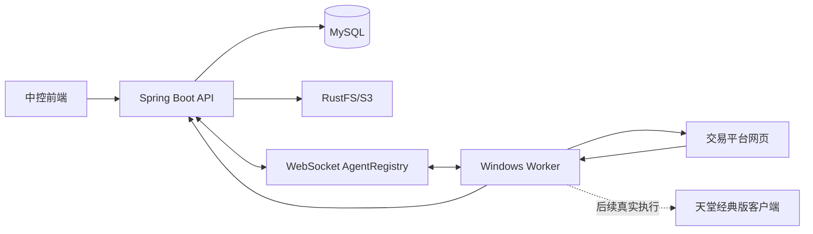
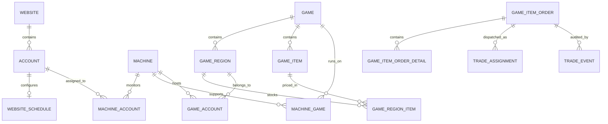

# 业务逻辑说明书（SPI-DES-BizLogic-BL）V1.0

## 1. 文档说明

### 1.1 编写目的

本文档依据 `auto_work` 项目 `dev` 分支当前代码，对系统实际存在的业务对象、业务规则、处理流程、状态变化、平台差异、异常策略和实现边界进行详细梳理。本文档用于：

- 帮助产品和运营理解当前系统能做什么、不能做什么；
- 帮助开发定位业务逻辑所在模块及上下游依赖；
- 帮助测试设计端到端场景、状态流转和异常用例；
- 帮助运维理解中控、Worker、数据库和对象存储的运行关系；
- 为后续实现游戏内真实交易、外置采集和输入执行能力预留统一语义。

### 1.2 代码基线

| 项目 | 内容 |
|---|---|
| 代码分支 | `dev` |
| 基线提交 | `f313352` |
| 基线日期 | 2026-07-16 |
| 后端 | Java 17、Spring Boot、MyBatis-Plus、MySQL |
| 前端 | Vue 3、Vite、Element Plus |
| Worker | Python、Patchright/Playwright、WebSocket |
| 文件存储 | RustFS/S3 兼容对象存储 |
| 目标运行环境 | 中控可容器化；Worker 运行于 Windows 游戏/网站操作机器 |

### 1.3 状态标识

本文使用以下标识描述成熟度：

| 标识 | 含义 |
|---|---|
| 已实现 | 当前代码存在完整业务入口和处理逻辑 |
| 部分实现 | 已具备主链路，但平台、异常或闭环尚不完整 |
| 模拟实现 | 协议和状态闭环可运行，但不执行真实游戏操作 |
| 设计预留 | 已存在接口、字段或状态设计，尚无业务执行实现 |
| 当前缺口 | 代码、数据库或协议之间存在不一致或风险 |

## 2. 系统业务定位

系统是一个面向游戏虚拟资产交易的中控平台。第一阶段目标不是让 Worker 自主领取订单，而是由总控根据订单所需游戏和区服、机器在线情况、机器上已登录的游戏账号、执行器空闲情况及 UI 健康度，唯一指派一笔订单给一台机器。

当前系统包含三条相互关联的业务主线：

1. 基础资源配置：维护网站、网站账户、游戏、区服、商品、库存、机器、游戏账号及话术。
2. 网站订单监控：中控向指定 Worker 下发网站订单检查任务，Worker 登录平台、持续监测并上报新订单。
3. 自动交易调度：订单完成招呼后进入待指派，总控选择合格机器和游戏账号，通过 offer/start 两阶段协议授权执行。

## 3. 当前能力总览

| 业务域 | 当前能力 | 成熟度 |
|---|---|---|
| 网站与账户 | 网站、登录方式、平台账户维护；账户密码加密 | 已实现 |
| 机器资源 | Worker 注册、心跳、上下线、机器角色关联 | 已实现 |
| 订单监控 | 中控指定账户并选择在线关联机器执行监控 | 已实现 |
| Itemmania | 登录、列表刷新、新订单明细采集、标准化上报 | 部分实现，三平台中最完整 |
| Barotem | 登录、订单数量监测、变化提醒 | 部分实现 |
| Itembay | 登录、数量监测、列表刷新及部分确认动作 | 部分实现 |
| 订单入库 | 幂等去重、游戏/区服映射、平台字段落库 | 已实现 |
| 自动招呼 | 加载游戏/区服话术，经 Worker 发送网页聊天 | 部分实现，主要适配 Itemmania |
| 自动选机 | 按游戏、区服、账号、运行态、优先级筛选 | 已实现 |
| 指派协议 | 30 秒租约、offer/decision/start、令牌校验 | 已实现 |
| 游戏内交付 | 控制客户端查找买家、核验、交付 Adena | 模拟实现，未操作游戏 |
| 采集/输入架构 | 兼容软件画面方案 A 与外置采集/输入方案 C | 设计预留；第一阶段仅计划 A |

## 4. 参与角色与职责

| 角色 | 主要职责 |
|---|---|
| 运营人员 | 配置网站、账户、游戏、区服、商品、库存、话术和机器；查看及维护订单 |
| 中控服务 | 保存主数据，管理 Worker 连接，接收订单，执行招呼和交易调度 |
| Windows Worker | 登录网站、监测订单、发送聊天、上报游戏客户端运行态、接收交易指派 |
| 网站平台 | 提供卖家订单、订单详情、聊天和交易确认页面 |
| 游戏客户端 | 最终执行虚拟资产交付；当前代码尚未接入真实控制 |
| 买家 | 在网站下单，并在游戏内以角色身份接收资产 |

## 5. 核心领域模型

### 5.1 网站监控域

| 对象 | 业务含义 | 关键字段/规则 |
|---|---|---|
| Website | 被监控的交易网站 | 名称、URL、分类、登录类型、登录配置、启用状态 |
| Account | 网站卖家账户 | 归属网站、标签、用户名、加密密码、扩展配置、默认账户、启用状态 |
| WebsiteSchedule | 账户监控计划 | 刷新间隔、无计划/单次/定时、时间或 Cron、提醒音频、启用状态 |
| MachineAccount | 网站账户与 Worker 机器关系 | 只有与账户关联且在线的机器可接收该账户的监控任务 |
| CookiesStore | 历史 Cookie 存储对象 | 当前 Worker 主流程以持久化浏览器 profile 为主 |

### 5.2 游戏商品域

| 对象 | 业务含义 | 关键字段/规则 |
|---|---|---|
| Game | 游戏主数据 | 名称、唯一代码、平台、启用状态 |
| GameRegion | 游戏区服 | 归属游戏；同一游戏下区服代码唯一 |
| GameItem | 可交易物品 | 支持普通物品和礼包父子结构，归属游戏 |
| GameRegionItem | 区服商品库存及价格 | 库存、采购价、售价、最低/最高价、价格波动控制 |
| GameScript | 游戏级话术 | 标题、文本、图片、分类、排序、启用状态 |
| RegionScript | 区服级话术 | 可关联游戏话术，也可作为独立区服话术 |

### 5.3 执行资源域

| 对象 | 业务含义 | 关键字段/规则 |
|---|---|---|
| Machine | Worker 所在机器 | MAC 唯一；在线、离线、忙碌、禁用；记录最后心跳 |
| MachineGame | 机器可执行的游戏 | 优先级、最大并发、启用状态 |
| GameAccount | 机器上的游戏账号 | 游戏、区服、机器、加密密码；空闲/占用/锁定/禁用 |
| WorkerRuntimeStatus | Worker 心跳中的实时能力 | 当前游戏、账号、区服、客户端状态、执行器状态、任务号、UI 健康度 |

### 5.4 订单与调度域

| 对象 | 业务含义 | 关键字段/规则 |
|---|---|---|
| GameItemOrder | 订单主表 | 内部单号、平台来源单号、游戏区服、买家角色、资产及数量、双状态、指派信息、错误信息 |
| GameItemOrderDetail | 订单明细 | 物品快照、数量、单价、小计、采购/售价快照、处理状态 |
| TradeAssignment | 一次交易指派 | assignmentId、订单、机器、游戏账号、租约、状态、执行令牌摘要 |
| TradeEvent | 交易审计事件 | 事件类型、前后状态、消息、载荷、发生时间 |

### 5.5 主要关系

## 6. 基础资料业务逻辑

### 6.1 网站管理

1. 运营维护网站名称、访问地址、图标、业务分类、登录类型及登录配置。
2. 登录类型支持表单登录、验证码登录和 OAuth 等配置语义；Worker 当前重点实现表单及需要人工参与的验证码登录。
3. 网站可以停用。停用网站不能发起订单监控任务。
4. 网站删除由 CRUD 接口直接执行，代码层未形成完整的关联数据删除保护，运营删除前应检查账户和订单引用。

### 6.2 网站账户管理

1. 新增账户必须指定网站、标签、用户名和密码。
2. 密码写入前使用系统密钥加密；查询实体时密码字段不返回给前端。
3. 修改账户时，只有传入非空密码才重新加密，未传密码则保留原密码。
4. 同一网站只允许一个默认账户。将某账户设为默认时，系统先取消该网站其他账户的默认标记。
5. 账户停用后不能发起监控任务。
6. `extra_fields` 用于保存扩展映射，订单入库会读取其中的 `trade_game_id` 和 `trade_region_map`。

### 6.3 监控计划

1. 每个网站账户维护一份监控计划，保存刷新间隔、调度类型、时间、Cron、提醒音频和启用状态。
2. 调度类型包括 `none`、`once`、`scheduled`。当前代码主要完成配置保存和复制，未发现后端按计划自动创建监控任务的完整调度器。
3. 复制配置时可选择多个目标账户；目标不存在或已有配置时跳过，不覆盖已有配置。
4. 提醒音频允许 MP3、WAV、OGG、FLAC、M4A、WMA，最大 10 MB。
5. 音频仅允许写入对象存储 `uploads/audio/` 路径；替换文件时包含新文件失败回滚和旧文件安全删除逻辑。

### 6.4 游戏、区服和商品

1. 游戏代码全局唯一，用于订单平台游戏名称到内部游戏的映射。
2. 同一游戏下区服代码唯一。
3. 新建区服后，系统为该游戏所有启用商品初始化区服库存记录，初始库存为 0。
4. 商品支持礼包结构：父商品标记 `is_bundle`，子商品通过 `parent_id` 关联。
5. 区服库存支持单条和批量更新；批量接口校验重复库存 ID 及数值边界。
6. 订单明细创建时会保存物品名称、图片和价格快照，避免后续商品改名或价格变化影响历史订单。

### 6.5 机器角色配置

机器存在两类互斥角色：

- 账户机器：通过 `MachineAccount` 关联网站账户，用于网页登录、订单监控和发送招呼；
- 游戏机器：通过 `MachineGame` 关联游戏，并配置本机游戏账号，用于接收游戏交易指派。

业务规则：

1. 已关联网站账户的机器不能再关联游戏。
2. 已关联游戏的机器不能再关联网站账户。
3. 前端根据关联关系显示“账户”“游戏”或“未绑定”。
4. 同一机器与同一游戏、同一机器与同一账户不得重复关联。
5. 游戏机器关系包含 `priority` 与 `max_concurrent`；当前选机逻辑使用优先级，但尚未实际执行最大并发限制。

### 6.6 游戏账号

1. 游戏账号必须绑定游戏、区服和机器。
2. 密码加密保存，修改逻辑与网站账户相同。
3. 状态包括 `idle`、`in_use`、`locked`、`disabled`。
4. 自动选机只考虑数据库状态为 `idle` 且与 Worker 当前心跳账号一致的账号。

### 6.7 话术配置

1. 游戏话术和区服话术均支持文本、图片、分类、排序和启停。
2. 自动招呼只加载分类为“招呼”且启用的话术。
3. 发送顺序为游戏级话术在前、区服级话术在后，各自按服务查询顺序输出。
4. 话术项可仅含文本、仅含图片或同时包含两者；Worker 逐项发送。

## 7. Worker 注册与运行态

### 7.1 注册流程

1. Worker 启动后计算本机 MAC，并采集主机名、IP 和操作系统信息。
2. Worker 连接 `/api/agent/ws`，发送 `register`。
3. 中控按 MAC 查询机器；不存在时创建，存在时更新主机信息、在线状态和最后心跳。
4. 中控将当前 WebSocket 会话绑定至机器。如果同一机器已有旧连接，则关闭旧会话并清理旧会话上的任务。
5. 注册成功后 Worker 开始周期心跳，断线后每 5 秒尝试重连。

### 7.2 心跳与运行态

Worker 默认每 20 秒上报一次心跳，业务字段包括：

| 字段 | 含义 | 调度用途 |
|---|---|---|
| game_id | 当前运行游戏 | 必须与订单游戏一致 |
| game_account_id | 当前登录游戏账号 | 必须与候选游戏账号一致 |
| region_id | 当前区服 | 必须与订单区服一致 |
| client_status | 游戏客户端状态 | 选机要求 `logged_in` |
| character_name | 当前角色 | 展示/核验预留 |
| executor_status | 执行器状态 | 选机要求 `idle` |
| current_assignment_id | 当前指派 | 防止并发和诊断 |
| ui_health | UI 健康度 | 选机要求 `ready` |

中控将上述运行态保存在内存，不落数据库。Worker 断开时，中控将机器置为离线、删除运行态，并将该会话相关监控任务标记失败。

## 8. 网站订单监控流程

### 8.1 发起监控

1. 运营在账户或调度页面发起订单检查，提交网站账户，可选指定机器。
2. 中控校验账户存在且启用、网站存在且启用。
3. 中控查询账户与机器的有效关联。
4. 如指定机器，必须同时满足“已关联该账户”和“Worker 在线”；未指定时选择第一个在线关联机器。
5. 中控解密网站账户密码，生成 `order_{websiteId}_{accountId}_{epochSeconds}` 任务号。
6. 中控通过 WebSocket 下发 `order_check`，包含网站 URL、登录类型、登录配置、账户及密码。
7. 同一网站账户同时只能有一个活动监控任务。

### 8.2 Worker 浏览器会话

1. Worker 为网站账户创建可复用的持久化浏览器上下文。
2. 浏览器使用韩语区域 `ko-KR` 和首尔时区 `Asia/Seoul`。
3. 浏览器 profile 以账户维度保存在本机；本机无 profile 时可从对象存储下载。
4. 会话关闭时上传 profile，上传内容排除缓存、锁文件等非必要文件。
5. 多个页面任务共享同一账户会话，通过引用计数管理生命周期。
6. 表单登录由配置选择器驱动；验证码登录可暂停等待人工处理，并播放提醒音频，默认等待上限 300 秒。

### 8.3 监控执行模型

1. Worker 根据网站 ID 选择平台监控器。当前实现硬编码：1 为 Itemmania、2 为 Barotem、3 为 Itembay。
2. 监控器启动一个或多个页面 Worker，并行执行订单检测、页面刷新等职责。
3. 健康检查发现页面 Worker 崩溃或长时间无活动时，尝试重新启动。
4. 连续提取失败达到 3 次时播放告警音。
5. 订单数量或状态变化时可播放账户配置的提醒音频。
6. 中控下发取消或 WebSocket 断开时，Worker 设置停止事件并结束相关监控线程。

### 8.4 平台实现差异

| 平台 | 当前实现 | 订单明细上报 | 说明 |
|---|---|---|---|
| Itemmania | 出售订单列表轮询、登记页刷新、订单详情并发抓取、状态标准化 | 是 | 主订单 Worker 约 3 秒轮询；登记刷新约 40 秒 |
| Barotem | 登录、侧栏订单数量检测、验证码/重登弹窗处理、音频提醒 | 否或未形成完整链路 | 当前未见标准订单明细构造与上报闭环 |
| Itembay | 新订单数量检测、列表刷新、部分确认点击 | 否或未形成完整链路 | 当前未见标准订单明细构造与上报闭环 |

### 8.5 去重策略

订单去重分为两层：

1. Worker 本地保存已上报平台订单号，减少同一进程内重复上报。
2. 上报前请求中控批量查询已存在的平台订单号；中控以网站 ID 与平台订单号组合判断重复。

当后端去重查询失败时，Worker 采用 fail-open 策略，即继续上报，由数据库唯一约束和入库服务再次保证幂等，避免因中控短暂异常漏单。

## 9. 平台订单标准化与入库

### 9.1 标准订单

Worker 将平台数据转换为统一订单，核心内容包括：平台标识、平台订单号、游戏名称、区服外部代码、资产类型、资产数量、买家角色、平台状态、标题、价格、下单时间、商品分类及数量。

当前第一阶段只接受 `adena` 资产。韩文金额解析支持万、亿、兆及千/百/十组合，并要求输入只能解析出一个确定数值。

### 9.2 入库校验

1. 平台必须是 `itemmania`、`barotem` 或 `itembay`。
2. 平台订单号、区服、买家角色、平台状态等字段受长度限制。
3. 资产数量必须为正数。
4. 中控校验网站账户有效，并以 `(website_id, source_order_no)` 查询现有订单。
5. 已存在订单直接视为幂等成功，不重复创建。

### 9.3 游戏映射

游戏 ID 按以下优先级解析：

1. 网站账户 `extra_fields.trade_game_id`；
2. 使用 Worker 上报的游戏名称作为游戏代码查询；
3. 无法解析时使用缺失标记，订单进入挂起。

### 9.4 区服映射

区服 ID 按以下优先级解析：

1. 网站账户 `extra_fields.trade_region_map[平台区服键]`；
2. 按内部游戏 ID 与平台区服代码查询；
3. 无法解析时使用缺失标记，订单进入挂起。

### 9.5 初始交付状态

| 条件 | delivery_status | 错误码 | 后续处理 |
|---|---|---|---|
| 游戏或区服无法映射 | suspended | CONFIG_MISSING | 需补配置并人工处理 |
| 资产不是 Adena | suspended | UNSUPPORTED_ASSET | 第一阶段不处理 |
| 配置完整且资产受支持 | greeting | 无 | 进入自动招呼 |

### 9.6 入库后动作

1. 保存订单主表和平台原始业务字段。
2. 写入 `order_detected` 交易事件。
3. 正常订单异步触发自动招呼。
4. 数据库唯一约束冲突按重复订单处理；其他完整性异常记录日志后结束本次入库。

## 10. 自动招呼流程

### 10.1 前置条件

- 订单 `delivery_status` 为 `greeting`；
- 订单总状态不是 `completed` 或 `cancelled`；
- 订单已存在 `assigned_machine_id`；
- 指定机器关联了与订单网站一致的网站账户。

### 10.2 自动触发

1. 订单入库服务启动异步线程调用招呼服务。
2. 招呼服务加载游戏级“招呼”话术，再加载区服级“招呼”话术。
3. 无有效话术时不发送聊天，订单直接从 `greeting` 转为 `waiting_assignment`。
4. 有话术时，中控构造平台聊天 URL 并下发 `greeting` 消息。
5. Worker 复用对应网站账户的浏览器会话，打开聊天页面。
6. Worker 按顺序发送图片和文本；图片先下载到本地临时文件再上传网页。
7. Worker 通过 `greeting_result` 返回成功或失败。

### 10.3 结果处理

| 结果 | 状态变化 | 错误信息 |
|---|---|---|
| 成功 | greeting → waiting_assignment | 清空或无错误 |
| 无话术 | greeting → waiting_assignment | 无错误 |
| 下发失败 | greeting → suspended | GREETING_FAILED |
| Worker 发送失败 | greeting → suspended | GREETING_FAILED + 失败原因 |

前端允许对仍处于 `greeting` 且未完成/未取消的订单手工触发“重新招呼”。

### 10.4 平台限制

当前聊天 URL 只对 Itemmania 构造，格式基于平台订单号。Barotem 和 Itembay 的聊天 URL 为空；而 Worker 在有话术时要求聊天 URL 非空，因此这两个平台的自动招呼当前不能形成成功闭环。无话术时会直接进入待指派，不受该限制。

## 11. 自动交易指派

### 11.1 调度入口

调用 `POST /api/trades/{orderId}/dispatch` 发起调度。当前前端尚未封装或展示该入口，主要由 API 调用。

订单必须同时满足：

- `delivery_status = waiting_assignment`；
- `asset_type = adena`；
- 游戏和区服已经正确映射。

### 11.2 候选机器构建

中控先查询订单游戏的有效机器关系，再查询订单游戏和区服下状态为空闲的游戏账号。候选机器必须满足：

1. 机器通过 `MachineGame` 支持订单游戏；
2. 机器上存在订单游戏及区服的空闲游戏账号；
3. Worker 在线；
4. Worker 心跳中的游戏账号与数据库候选账号相同；
5. Worker 心跳中的游戏和区服与订单相同；
6. `client_status = logged_in`；
7. `executor_status = idle`；
8. `ui_health = ready`。

### 11.3 排序选择

候选按以下顺序选择：

1. `MachineGame.priority` 降序；
2. 最近使用时间为空的优先，再按最近使用时间；
3. 机器 ID 作为稳定排序条件。

当前候选构建未提供真实最近使用时间，因此实际主要按优先级和机器 ID 选择。

### 11.4 Offer 阶段

1. 中控生成 UUID 格式 `assignment_id`。
2. 生成高强度随机执行令牌，租约 30 秒。
3. 数据库只保存令牌 SHA-256 摘要，不保存明文。
4. 创建 `TradeAssignment`，状态为 `offered`。
5. 订单由 `waiting_assignment` 转为 `offered`，保存 assignment ID。
6. 机器置为 `busy`，游戏账号置为 `in_use`。
7. 写入 `offer_sent` 交易事件。
8. 中控向目标 Worker 发送 `trade_offer`。

Worker 不会因为收到 offer 立即执行。它先检查本机是否已有活动指派、游戏和区服是否匹配、执行器是否空闲，再返回接受或拒绝。

### 11.5 Start 阶段

Worker 接受后：

1. 中控检查 assignment、机器和租约是否仍有效。
2. 指派状态更新为 `accepted`。
3. 订单由 `offered` 转为 `assigned`。
4. 写入 `offer_accepted` 事件。
5. 中控携带同一执行令牌发送 `trade_start`。
6. Worker 使用常量时间 HMAC 比较方式核验 assignment 和令牌。
7. 令牌一致且本机仍持有该指派时，Worker 才开始执行。

此设计将“候选机器愿意接受”与“总控最终授权执行”分开，避免多台机器同时处理同一订单。

### 11.6 拒绝、过期与发送失败

| 场景 | 订单状态 | 指派状态 | 资源处理 |
|---|---|---|---|
| Worker 拒绝 | offered → waiting_assignment | rejected | 机器恢复在线/离线实际状态，账号恢复 idle |
| 30 秒未接受 | offered → waiting_assignment | expired | 释放机器和账号 |
| start 下发失败 | assigned → suspended | start_failed | 释放机器和账号 |
| Worker 拒绝启动 | assigned → suspended | start_rejected | 释放机器和账号 |
| Worker 取消 | assigned → suspended | cancelled | 释放机器和账号 |

中控每 5 秒扫描一次未接受且租约已过期的 offer。

### 11.7 当前模拟执行

Worker 收到合法 `trade_start` 后仅执行以下动作：

1. 上报 `started`；
2. 上报 `simulation_completed`；
3. 清除本机活动指派。

中控收到 `simulation_completed` 后将订单从 `assigned` 置为 `suspended`，指派状态置为 `simulation_completed`，并释放机器与游戏账号。该行为用于验证调度闭环，不代表游戏资产已交付。

### 11.8 后续真实交易预留

状态枚举已预留：预检查、等待买家、核验买家、准备资产、人工/自动复核、确认、游戏交付、网站确认、完成、挂起和取消等阶段。架构计划同时兼容：

- 方案 A：本机软件方式获取游戏画面并执行输入；第一阶段真实执行优先实现该方案；
- 方案 C：外置采集卡获取画面，并通过外置 USB/HID 设备执行输入；后续接入。

当前代码没有屏幕采集、OCR/OpenCV、Windows 输入、采集卡或 HID 实现。

## 12. 订单人工管理

### 12.1 双状态模型

订单同时维护两组状态：

| 状态域 | 字段 | 用途 |
|---|---|---|
| 业务状态 | `status` | 前端人工订单管理：pending、assigned、processing、completed、cancelled |
| 自动交付状态 | `delivery_status` | 自动招呼和交易调度状态 |

两组状态当前并非完全联动。测试和运营判断订单时必须同时查看，不能只依据其中一个字段。

### 12.2 手工新建订单

1. 必须选择游戏和属于该游戏的区服。
2. 至少包含一条明细。
3. 每条明细商品必须存在且属于订单游戏。
4. 数量必须大于 0，单价不得小于 0。
5. 系统保存商品名称、图片、区服采购价和售价快照。
6. 主订单合计由所有明细小计重新计算，不信任前端传入总额。

### 12.3 主订单维护

1. 前端可修改客户名称、联系方式、业务状态、备注和分配机器。
2. `pending → assigned` 时记录分配时间。
3. 设置为 `completed` 时记录完成时间。
4. 只有 `pending` 或 `cancelled` 订单允许删除。
5. 前端“分配机器”是直接更新主订单机器和业务状态，不等同于自动交易 offer/start 调度。

### 12.4 明细维护

1. 只有业务状态为 `pending` 的订单可以增加、修改和删除明细。
2. 明细状态支持 `pending`、`processing`、`completed`、`failed`。
3. 明细变化后重新计算主订单总额。

## 13. WebSocket 协议

### 13.1 Worker → 中控

| 消息 | 业务用途 | 关键校验 |
|---|---|---|
| register | 注册机器和绑定会话 | MAC 唯一；新会话替换旧会话 |
| heartbeat | 上报在线和运行态 | 更新最后心跳及内存运行态 |
| task_status | 上报监控任务状态 | 任务与当前会话匹配 |
| task_result | 上报监控任务结果 | 完成后清理账户任务锁 |
| check_orders | 批量查询已入库订单号 | 账户与会话必须匹配 |
| order_detected | 上报标准订单 | 当前绑定会话校验、字段校验、幂等入库 |
| trade_offer_decision | 接受或拒绝指派 | assignment、机器、租约匹配 |
| trade_status | 上报交易执行状态 | assignment 已接受且机器匹配 |
| greeting_result | 上报招呼结果 | 按订单处理成功或挂起 |

### 13.2 中控 → Worker

| 消息 | 业务用途 | 关键内容 |
|---|---|---|
| registered | 注册确认 | machine_id |
| order_check | 启动订单监控 | 任务、网站、登录配置、账号凭据 |
| cancel | 取消监控任务 | task_id/account_id |
| orders_check_result | 返回已存在订单号 | source_order_nos |
| greeting | 执行网页招呼 | 订单、账户、话术、聊天 URL |
| trade_offer | 发出候选指派 | assignment、订单摘要、令牌、租约 |
| trade_start | 正式授权执行 | assignment、执行令牌 |
| trade_cancel | 取消交易 | assignment、原因 |

### 13.3 会话安全边界

当前协议以 MAC 注册和 WebSocket 当前会话绑定作为主要信任边界，未见独立的 Worker 身份证书、签名或访问令牌认证。交易执行令牌仅用于一次指派授权，不能替代 Worker 身份认证。

## 14. API 业务清单

| API 组 | 主要能力 |
|---|---|
| `/api/websites` | 网站分页、全量、分类、详情、新增、修改、删除 |
| `/api/accounts` | 网站账户分页、全量、详情、新增、修改、删除 |
| `/api/schedules` | 监控计划查询、保存、复制、上传提醒音频 |
| `/api/games` | 游戏分页、全量、详情及 CRUD |
| `/api/game-regions` | 区服分页、全量及 CRUD |
| `/api/game-items` | 商品、礼包、礼包子项及 CRUD |
| `/api/region-inventories` | 区服库存查询、单条和批量更新 |
| `/api/machines` | 机器及机器-游戏、机器-网站账户关系管理 |
| `/api/game-accounts` | 游戏账号筛选及 CRUD |
| `/api/scripts` | 游戏话术和区服话术管理 |
| `/api/automation/order-check` | 启动、查询、取消网站订单监控 |
| `/api/orders` | 订单、明细、人工分配、重新招呼 |
| `/api/trades` | 自动交易指派及非敏感状态查询 |
| `/api/upload`、`/uploads/**` | 文件上传和对象读取代理 |
| `/api/health` | 服务健康检查 |

## 15. 前端业务入口

| 页面 | 主要操作 |
|---|---|
| 网站管理 `/websites` | 维护交易网站和登录配置 |
| 账户管理 `/accounts` | 维护网站账户并发起监控相关操作 |
| 调度管理 `/schedules` | 配置刷新、时间计划和提醒音频 |
| 游戏管理 `/games` | 维护游戏、区服及相关话术入口 |
| 商品管理 `/game-items` | 维护普通商品和礼包结构 |
| 区服库存 `/region-inventories` | 维护库存和价格 |
| 机器管理 `/machines` | 查看在线状态，配置账户机器或游戏机器角色 |
| 游戏账号 `/game-accounts` | 维护机器上的游戏账号和占用状态 |
| 订单管理 `/orders` | 查询、新建、编辑、人工分配、明细维护、重新招呼 |

订单页已展示业务状态与交付状态，但当前交付状态标签只覆盖部分实际/设计状态；`offered`、`prechecking` 等状态可能直接显示原始值。

## 16. 异常处理与恢复

| 异常 | 当前处理 |
|---|---|
| Worker 断线 | 机器置离线、运行态移除、相关监控任务失败；Worker 自动重连 |
| 旧连接被新连接替换 | 关闭旧会话并清理旧会话任务 |
| 浏览器登录失败 | 任务失败；验证码模式允许人工介入并超时 |
| 页面提取连续失败 | 记录错误并播放告警音，健康监控可重启页面 Worker |
| 后端去重查询失败 | Worker 继续上报，由中控和唯一约束兜底 |
| 游戏/区服映射缺失 | 订单入库但自动交付挂起，记录 CONFIG_MISSING |
| 招呼发送失败 | 订单挂起，记录 GREETING_FAILED |
| 没有合格游戏机器 | 调度 API 返回业务冲突，不创建有效执行 |
| offer 被拒绝或超时 | 回到待指派并释放资源，可再次调度 |
| Worker 模拟完成 | 订单挂起并释放资源，等待下一阶段或人工处理 |

## 17. 数据、安全与一致性规则

1. 网站账户和游戏账户密码使用应用密钥加密，API 不返回明文密码。
2. 交易执行令牌仅存在于中控内存和 WebSocket 消息，数据库只保存 SHA-256 摘要，HTTP 指派响应不返回令牌。
3. 订单自动交付状态更新使用“期望原状态 + row_version”进行乐观并发控制，并在更新后重新读取。
4. 平台订单通过网站 ID 与平台订单号组合实现幂等。
5. 文件上传使用对象存储，音频替换限制在受控路径。
6. WebSocket 入站消息存在约 32 KiB 大小限制，防止超大消息占用资源。
7. 当前 SQL 初始化文件包含示例/现场数据和加密凭据，不应直接作为公开样例分发，也不应在文档中复制其中的账户内容。

## 18. 当前实现边界与已识别风险

### 18.1 高优先级一致性问题

| 编号 | 问题 | 影响 | 建议 |
|---|---|---|---|
| R-01 | `MachineAccount` 实体和接口已存在，但 `sql/auto_login.sql` 未创建 `machine_accounts` 表 | 新库初始化后账户机器关联功能可能直接失败 | 增加建表和索引脚本，并做全新库启动验证 |
| R-02 | `RegionScript.imageUrl` 按驼峰映射期望 `image_url`，SQL 实际列为 `position_image` | 区服话术图片读写可能报列不存在或始终为空 | 统一实体字段映射或迁移数据库列 |
| R-03 | 平台时间格式允许 `MM-dd HH:mm`，但直接按 `LocalDateTime` 解析需要年份 | 平台下单时间可能静默为空 | 补当前年份/跨年规则并使用明确 formatter |
| R-04 | 实际使用 `greeting` 状态，但 `TradeDeliveryStatus` 枚举未包含该状态 | 状态机、校验和前端展示语义漂移 | 将招呼纳入统一状态机或独立为前置状态域 |

### 18.2 调度可靠性风险

| 编号 | 问题 | 影响 | 建议 |
|---|---|---|---|
| R-05 | pending offer 和已接受集合保存在单机内存 | 中控重启后无法继续处理已落库租约 | 启动时恢复未完成指派，或将租约状态完全数据库化 |
| R-06 | WebSocket 下发发生在数据库事务提交前 | Worker 可能先响应，而数据库事务尚未提交 | 使用事务提交后事件/outbox 下发 |
| R-07 | `max_concurrent` 未参与候选筛选 | 配置值不生效；未来多并发可能超配 | 统计活动指派数并纳入选机 |
| R-08 | 最近使用时间未传入候选 | 同优先级机器负载不均 | 记录并使用机器/账号最后成功指派时间 |
| R-09 | 招呼异步使用原生 `new Thread` | 线程不可管理，异常、停机和容量难控制 | 改为受管线程池或可靠任务队列 |

### 18.3 平台与协议风险

| 编号 | 问题 | 影响 | 建议 |
|---|---|---|---|
| R-10 | Barotem、Itembay 未形成订单详情标准化上报 | 两个平台不能完整进入自动交易链路 | 分平台补充详情抓取、状态映射和回归用例 |
| R-11 | Barotem、Itembay 未构造聊天 URL | 有招呼话术时必然失败并挂起 | 实现平台聊天适配器，或按平台禁用自动招呼 |
| R-12 | Worker 注册主要依赖 MAC，无强身份认证 | 可伪造机器连接或上报 | 增加双向 TLS、设备令牌或签名认证 |
| R-13 | `greeting_result` 的会话校验弱于订单和交易消息 | 非目标会话可能提交招呼结果 | 校验订单分配机器、账户和当前绑定会话 |
| R-14 | 平台适配按固定网站 ID 选择 | 数据迁移或不同环境 ID 变化会选错适配器 | 改用稳定平台代码而不是数据库自增 ID |

### 18.4 业务语义风险

| 编号 | 问题 | 影响 | 建议 |
|---|---|---|---|
| R-15 | 人工业务状态与自动交付状态未完全联动 | 页面可能出现“业务已完成、交付仍挂起”等组合 | 明确主状态或建立组合状态约束 |
| R-16 | 手工“分配机器”与自动交易指派含义不同 | 运营可能误认为已触发 offer/start | UI 文案区分“记录负责人”和“启动自动调度” |
| R-17 | SQL 对游戏/区服缺失使用特殊值依赖弱约束 | 启用外键后缺失订单可能无法保存 | 使用可空外键或独立映射异常表 |
| R-18 | 初始化 SQL 包含现场式数据 | 环境复制、隐私和配置污染风险 | 拆分 schema、基础字典和环境种子数据 |

## 19. 推荐测试场景

### 19.1 配置与约束

1. 同网站只能设置一个默认账户。
2. 网站或账户停用后不能启动监控。
3. 账户机器与游戏机器角色互斥。
4. 新建区服后为全部启用商品初始化库存。
5. 游戏账号密码新增和修改后均不可从 API 读取明文。

### 19.2 订单监控

1. 未关联机器、关联机器离线、指定错误机器时启动失败。
2. 同账户重复启动时保持单活动任务。
3. Worker 重连替换旧会话，旧任务正确失败。
4. Itemmania 同一订单多轮抓取只入库一次。
5. 中控去重查询失败时仍能靠数据库防重。

### 19.3 招呼

1. 无话术直接进入 `waiting_assignment`。
2. 文本、图片、图文混合话术按顺序发送。
3. Worker 离线或聊天页面失败后订单进入 `suspended`。
4. Itemmania 手工重新招呼成功。
5. Barotem/Itembay 有话术时验证当前预期失败并记录明确错误。

### 19.4 自动指派

1. 游戏、区服、账号、客户端状态、执行器状态或 UI 状态任一不匹配时不入候选。
2. 多台合格机器按优先级选中唯一机器。
3. Worker 拒绝后订单回到待指派，资源释放。
4. offer 超过 30 秒自动过期，状态和资源恢复。
5. 重复 offer、错误 token、错误 assignment 不启动。
6. start 下发失败时订单挂起且资源释放。
7. 模拟完成后订单挂起、指派结束、机器和账号恢复。
8. 并发调度同一订单时乐观锁阻止重复状态迁移。

## 20. 部署与运行关系

Docker Compose 提供 MySQL、RustFS、Spring Boot 后端、Vite 开发前端及生产 Nginx 前端。默认端口为：

| 服务 | 默认端口 | 说明 |
|---|---|---|
| MySQL | 3306 | 初始化读取 `sql/`，仅首次创建数据卷时执行 |
| RustFS | 9000 | 存储音频、图片和浏览器 profile |
| Backend | 8000 | REST API 与 WebSocket |
| Frontend dev | 5173 | Vite 开发服务 |
| Frontend prod | 80 | 使用 `prod` profile 启用 |

生产部署必须覆盖默认数据库密码、应用加密密钥和对象存储凭据。应用加密密钥变化会导致历史账户密码无法解密。

## 21. 代码追溯矩阵

| 业务能力 | 主要代码位置 |
|---|---|
| 网站/账户/计划 | `backend/.../controller/WebsiteController.java`、`AccountController.java`、`ScheduleController.java` |
| 游戏/区服/商品/库存 | `GameController.java`、`GameRegionController.java`、`GameItemController.java`、`GameRegionItemController.java` |
| 机器与账号 | `MachineController.java`、`GameAccountController.java` |
| 订单人工管理 | `OrderController.java`、`frontend/src/views/OrderList.vue` |
| Worker 注册与协议 | `backend/src/main/java/com/auto/ws/AgentRegistry.java`、WebSocket handler；`worker/agent.py` |
| 网站监控 | `worker/automation/` 下平台监控器、浏览器会话与上报器 |
| 订单入库 | `MarketplaceOrderIngestionService.java`、`OrderDetectedMessage.java` |
| 自动招呼 | `GreetingDispatchService.java`、`worker/automation/greeting_handler.py`、`chat_sender.py` |
| 交易状态机 | `TradeDeliveryStatus.java` |
| 机器选择 | `TradeMachineSelector.java`、`TradeDispatchCoordinator.java` |
| 指派 API | `TradeDispatchController.java` |
| Worker 模拟执行 | Worker 交易门禁和 `trade_offer`/`trade_start` 消息处理代码 |
| 数据库基线 | `sql/auto_login.sql` |

## 22. 术语

| 术语 | 说明 |
|---|---|
| 中控 | Spring Boot 后端及其管理前端，负责统一配置、订单和调度 |
| Worker/Agent | 部署在 Windows 机器上的执行进程 |
| 网站账户 | 登录 Itemmania、Barotem、Itembay 等平台的卖家账户 |
| 游戏账号 | 登录天堂经典版等游戏客户端的角色账号 |
| Offer | 中控向候选机器发出的限时指派提议，不代表最终执行授权 |
| Start | Worker 接受 Offer 后，中控发出的最终执行授权 |
| Lease | Offer 的有效租约，当前为 30 秒 |
| Adena | 天堂系列游戏中的金币资产，当前自动交易阶段唯一支持的资产类型 |
| 业务状态 | 人工订单管理使用的 `status` |
| 交付状态 | 自动招呼和交易流程使用的 `delivery_status` |

## 23. 基线结论

当前代码已经具备基础资料管理、网站账户与机器绑定、Worker 在线管理、Itemmania 订单采集、订单幂等入库、自动招呼及基于机器实时状态的唯一指派能力。系统的关键架构原则已经体现为“总控掌握订单所有权，Worker 只在接受 Offer 且收到 Start 授权后执行”。

但当前尚不能完成真实的天堂经典版游戏内交易：Worker 的交易步骤仍为模拟，Barotem/Itembay 的订单详情与招呼适配不完整，且数据库脚本、状态枚举和实体字段存在若干需要优先修复的一致性问题。后续开发应先完成 R-01 至 R-04 的基线修复，再进入方案 A 的画面识别、买家核验和游戏输入执行实现，并保留方案 C 的适配接口。

